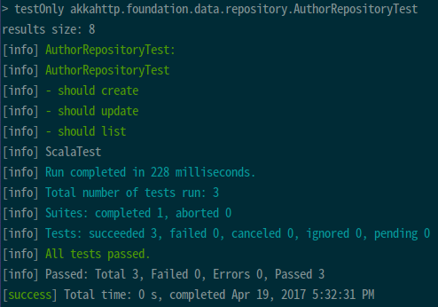

# 使用 JDBC

在 Scala 中，Java 的数据库访问方式都可以使用，比如：JDBC、JPA、MyBatis、Hibernate等。除此之外，也有些专为 Scala 作者的数据库访问库，如：
Slick、ScalikeJDBC、Quill等。但这里，我们介绍在 Scala 中怎样使用 JDBC。

## PostgreSQL

首先，安装 **PostgreSQL** 数据库。

**Linux**

```bash
apt-get install postgresql // Debian/Ubuntu
yum install postgresql // Fedora/CentOS/RHEL
```

**Mac**

```bash
brew install postgresql
```

**Windows**

到 EnterpriseDB 官网下载二进制安装包：`[https://www.enterprisedb.com/downloads/postgres-postgresql-downloads#windows](https://www.enterprisedb.com/downloads/postgres-postgresql-downloads#windows)`

**配置网络**

Linux下，PostgreSQL默认是不允许通过远程网络访问的。我们需要修改下它的默认配置。

- *Ubunux*：`/etc/postgresql/9.6/main` 目录
- *CentOS*：`/var/lib/pgsql/data` 目录

1. 编辑 `postgresql.conf` 文件，去掉 `listen_address` 的注释，并修改为：

```
listen_address = '*'
```

同时也去掉 `password_encryption` 的注释。

2. 编辑 `pg_hba.conf` 文件，添加：`host    all      all    0.0.0.0/0    md` ，设置允许所有网络访问并使用 `md5` 形式的密码登录机制。

**创建账号及初使化库、表**

*创建账号、数据库*

```
sudo su - postgres
psql
postgres=# create user hldev nosuperuser encrypted password 'hldev';
postgres=# create database hldev owner=hldev template=template0 encoding='UTF-8' lc_collate='zh_CN.UTF-8' lc_ctype='zh_CN.UTF-8';
```

*初始化表、数据*

```sql
CREATE TABLE author(
  id bigserial,
  name VARCHAR(255) NOT NULL,
  age int,
  remark TEXT,
  PRIMARY KEY (id)
);

CREATE TABLE book(
  isbn VARCHAR(64),
  author bigint NOT NULL,
  title VARCHAR(255) NOT NULL,
  description VARCHAR(1024),
  amount DECIMAL NOT NULL,
  PRIMARY KEY (isbn)
);
```

## 访问数据库

首先，我们定义两个数据库实体对象：`Author` 和 `Book`：

```scala
case class Author(id: Long,
                  name: String,
                  age: Option[Int],
                  remark: Option[String])
case class Book(isbn: String,
                author: Long,
                title: String,
                amount: BigDecimal,
                description: Option[String])
```

接下来在 `AuthorRepository` 中进行数据库操作，现在先把什么 `Service`，`Controller`等放一边，我们使用 **scalatest** 来测试下我们的数
据库访问代码。

```scala
class AuthorRepositoryTest extends MeSpec with JDBCSpec {

  "AccountRepositoryTest" should {
    val accountRepository = new AuthorRepository(dataSource)

    "create" in {
      val account = Author(0, "羊八井", Some(31), None)
      val result = accountRepository.create(account)
      result.id must be > 0L
    }

    "update" in {
      val author = Author(3, "yangbajing", Some(32), Some("中国重庆江津"))
      val result = accountRepository.update(author)
      result.id mustBe author.id
    }

    "list" in {
      val results = accountRepository.list()
      results must not be empty
      println(s"results size: ${results.size}")
    }

  }
  
}
```

先不管 `MeSpec` 和 `JDBCSpec` 两个 trait，你可以先试试这个测试（前题是你已经设置好数据库环境）。

```scala
> testOnly akkahttp.foundation.data.repository.AuthorRepositoryTest
```



若一切正常，你会看到测试正确通过。`AuthorRepositoryTert` 脚本中一共执行了3个测试，其中 `should list` 测试中打印了一个测试输出，从数据库中
获取到8条记录。下面，让我们来看看 `AuthorRepository` ，我们怎么在 Scala 中使用 JDBC 来访问数据库的。

```scala
class AuthorRepository(dataSource: DataSource) {
  val jdbcTemplate = JdbcTemplate(dataSource) // ①

  def update(author: Author): Author = {
    require(author.id > 0L, "id 必有大于 0") // ②

    val (names, args) = AuthorRepository.generateArgs(author)
    args.append(author.id.asInstanceOf[Object])
    val updateSet = JdbcTemplate.sqlUpdateSets(names)
    val sql = s"UPDATE author SET $updateSet WHERE id = ?" // ③

    val ret = jdbcTemplate.executeUpdate(sql, args)
    if (ret == 1) author else throw new SQLException(s"账号：${author.id} 不存在")
  }

  def create(author: Author): Author = {
    require(author.id <= 1L, "id 不能存在")
      
    val (names, args) = AuthorRepository.generateArgs(author)
    val sql =
      s"""INSERT INTO author(${JdbcTemplate.sqlNames(names)})
         |  VALUES(${JdbcTemplate.sqlArgs(args)}) RETURNING id""".stripMargin // ④

    val (results, labels) = jdbcTemplate.queryMany(sql, args)

    val id = results.head.apply(labels.head.label).asInstanceOf[Long]
    author.copy(id = id)
  }

  def list(): Vector[Author] = {
    val (results, _) = jdbcTemplate.queryMany("SELECT id, name, age, remark FROM author ORDER BY id DESC")
    results.map(AuthorRepository.generateResult)
  }

}
```
