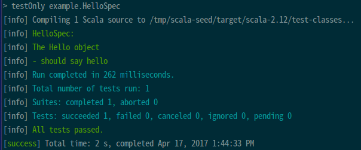

# Sbt

Scala有一套官方的编译、构建工具 Sbt，全称：The interactive build tool （交互构建工具）。它除了能做向 Maven、Gradle类似的事情以外，它还
有一个交互式的环境，可以在里面执行一些常用命令，甚至直接执行、测试代码。

## 安装 Sbt

*详细安装教程请阅读官方文档：http://www.scala-sbt.org/0.13/docs/Setup.html*

**Linux/Unix/Mac**

下载安装并配置Sbt：

```
wget https://dl.bintray.com/sbt/native-packages/sbt/0.13.15/sbt-0.13.15.tgz
tar zxf sbt-0.13.15.tgz
echo 'export SBT_HOME="/home/yangbajing/sbt-0.13.15"
export PATH="$SBT_HOME/bin:$PATH"
' >> ~/.bash_profile
. ~/.bash_profile
```

现在可以在当前终端执行 `sbt` 命令了，若在重启系统前需要在其它终端也运行 `sbt` 命令，需要执行 `. ~/.bash_profile` 以使环境变量生效。 

**Windows**

下载 [msi installer](https://dl.bintray.com/sbt/native-packages/sbt/0.13.15/sbt-0.13.15.msi) ，双击安装。

## 加速 Sbt

在国内（中华人民共和国），因为大部分源都在国外，访问及其不稳定。造成使用 Sbt 构建的项目在第一次下载依赖时非常的慢，甚至失败。（Maven、Gradle
等也有类似问题，都可以使用接下来介绍的国内镜像源）。我们可以使用 @老猪 制做的 [**Repox 社区公服**](http://centaur.github.io/repox/) 来
加速我们的 Sbt 工程。

为了使用 Repox ，需要做如下配置：

1. 配置 `~/.sbt/repositories` 文件（如果文件还未创建过，则创建它），除了本地缓存外，仅使用 repox 作为仓库。文件内容如下：

```
[repositories]
local
repox-maven: http://repox.gtan.com:8078/
repox-ivy: http://repox.gtan.com:8078/, [organization]/[module]/(scala_[scalaVersion]/)(sbt_[sbtVersion]/)[revision]/[type]s/[artifact](-[classifier]).[ext]
```

请注意，repox-maven 与 repox-ivy 的次序是重要的，请将 repox-maven 写在 repox-ivy 的前面。

2. 配置 Sbt，使它仅使用 `~/.sbt/repositories` 中的内容。

Linux/Unix/Mac 用户，编辑 `$SBT_HOME/conf/sbtconfig.txt` 文件，添加以下内容：

```
  -Dsbt.override.build.repos=true 
```

如果使用jetbrains IDEA，修改 Preferences -> SBT -> JVM Options -> VM parameters，保证它包含

```
  -Dsbt.override.build.repos=true 
```

如果使用 activator，请打开 `~/.activator/activatorconfig.txt` 文件（如果此文件不存在，请创建它。很明显，配置文件满天飞也是 typesafe/sbt team的诸多恶趣味之一），在其中添加一行

```
  -Dsbt.override.build.repos=true 
```

windows 用户可以 在 C:\Program Files (x86)\sbt\conf\sbtconfig.txt加入

```
  -Dsbt.override.build.repos=true 
```

## 创建一个 Sbt 项目

创建一个 Sbt 还是比较简单的，你可以从使用 `sbt new` 命令从线上众多的模板开始，也可以手动创建。

**`sbt new`**

```bash
sbt new scala/scala-seed.g8

Minimum Scala build. 

name [My Something Project]: scala-seed

```

当前目录下多了个 `scala-seed` 目录，通过 `sbt new` 创建的项目里面的 Scala 版本可能不是你想要的。不过在这里不用担心，保持默认即可。（本书
将基于 Scala 2.12.x 讲解）。

**Sbt 控制台**

Sbt 是一个交互式的构建工具，它具有一个 REPL 的命令行控制台，你可以在里面编译、运行、测试，甚至打包及执行自定义命令……

```scala
sbt
[info] Loading global plugins from /home/hldev/.sbt/0.13/plugins
[info] Loading project definition from /tmp/scala-seed/project
[info] Set current project to Hello (in build file:/tmp/scala-seed/)
> 
```

*运行示例程序*


*运行 scalatest 测试*


